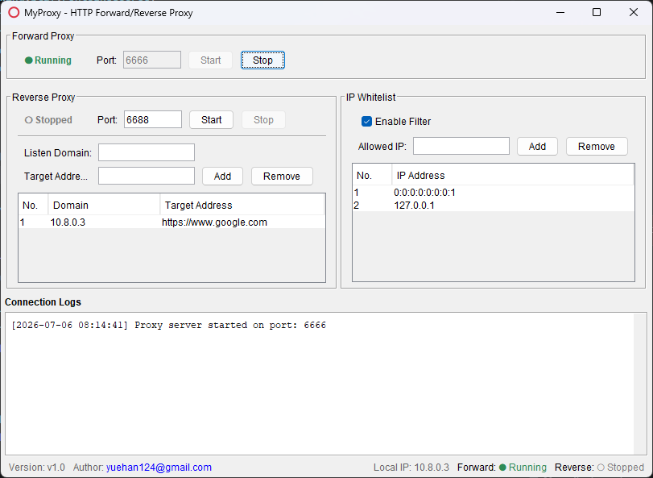

# MyProxy

A Java Swing desktop application that provides both HTTP forward proxy and reverse proxy capabilities.

## Features

- **Forward Proxy** — Based on [LittleProxy](https://github.com/LittleProxy/LittleProxy) (Netty-powered), with IP whitelist filtering support
- **Reverse Proxy** — Built on Netty natively, routes requests by Host header to configured backend addresses
- **Desktop GUI** — Swing tabbed interface with status display, control panels, whitelist management, reverse proxy rule management, and a shared log panel
- **Cross-Platform** — Supports Windows, macOS, and Linux desktops
- **System Tray** — Minimize to system tray, click tray icon to restore
- **i18n** — Supports English and Chinese UI languages
- **Status Bar** — Displays local IP address, proxy running status, version and author info

## Screenshot



## Tech Stack

| Item | Details |
| --- | --- |
| Language | Java 21 |
| Build | Maven |
| Proxy Core | `xyz.rogfam:littleproxy:2.0.22` (Netty-based) |
| JSON | `com.fasterxml.jackson:jackson-databind:2.13.5` |
| Logging | `ch.qos.logback:logback-classic:1.3.14` |
| Packaging | `maven-shade-plugin` producing executable fat jar |

## Project Structure

```
src/main/java/com/myproxy/
├── MyProxyApplication.java        # Application entry point
├── config/
│   ├── ConfigManager.java         # Configuration load/save (JSON)
│   ├── NetUtils.java              # Network utility (local IP detection)
│   └── ProxyConfig.java           # Configuration model
├── proxy/
│   ├── ProxyService.java          # Forward proxy service (LittleProxy)
│   └── ReverseProxyService.java   # Reverse proxy service (Netty)
└── ui/
    ├── I18nManager.java           # Internationalization manager
    ├── LogPanel.java              # Log output panel
    ├── MainFrame.java             # Main window
    ├── ProxyPanel.java            # Forward proxy control panel
    ├── ReverseProxyPanel.java     # Reverse proxy rule management
    ├── StatusBar.java             # Status bar (IP, proxy status, version)
    ├── SystemTrayManager.java     # System tray support
    ├── TableHeightUtil.java       # JTable height utility
    ├── UiUtils.java               # Shared UI constants and helpers
    ├── WhitelistPanel.java        # IP whitelist management
    └── WrapLayout.java            # Auto-wrapping FlowLayout variant
```

## Build & Run

```bash
# Build executable jar (target/myproxy-1.0.0.jar)
mvn clean package

# Run
java -jar target/myproxy-1.0.0.jar

# Run in development
mvn exec:java -Dexec.mainClass="com.myproxy.MyProxyApplication"
```

## Configuration

Configuration is stored at `~/.myproxy/config.json`. The file is auto-created with defaults on first launch.

### Default Settings

| Setting | Default |
| --- | --- |
| Forward Proxy Port | 6666 |
| Reverse Proxy Port | 6688 |
| Whitelist Enabled | false |
| Default Allowed IPs | `127.0.0.1`, `0:0:0:0:0:0:0:1` |
| Default Reverse Proxy Rule | Local IP → `https://www.google.com` |

### Configuration Example

```json
{
  "port" : 6666,
  "whitelistEnabled" : false,
  "allowedIps" : [ "127.0.0.1", "0:0:0:0:0:0:0:1" ],
  "reverseProxyPort" : 6688,
  "reverseProxyEnabled" : false,
  "reverseProxyRules" : [ {
    "domain" : "192.168.1.100",
    "target" : "https://www.google.com"
  } ],
  "language" : "en"
}
```

## Architecture

### Forward Proxy (`ProxyService`)
- Based on `DefaultHttpProxyServer` (LittleProxy), listening on `0.0.0.0:port`
- Injects an `HttpFiltersSourceAdapter` to extract client IP and validate against the whitelist; returns 403 for unauthorized IPs
- Logs and status are reported to the UI via `Consumer<String>` and `Consumer<Boolean>` callbacks
- All Swing callbacks use `SwingUtilities.invokeLater` for thread safety

### Reverse Proxy (`ReverseProxyService`)
- Based on Netty `ServerBootstrap`, listening on `0.0.0.0:reverseProxyPort`
- `ReverseProxyHandler`: parses the Host header, matches rules, connects to the backend, and forwards requests/responses
- `BackendHandler`: handles backend responses and writes them back to the client
- Returns 502 Bad Gateway when no matching rule is found

### UI (`ui` package)
- `MainFrame`: `JSplitPane` with forward/reverse proxy panels on the left, whitelist panel on the right, shared `LogPanel` at the bottom
- All long-running operations (start/stop proxy) run in separate threads to avoid blocking the EDT
- `SystemTrayManager`: dynamically generated tray icon with right-click menu (Show Window / Exit)

## License

[Apache License 2.0](LICENSE)
